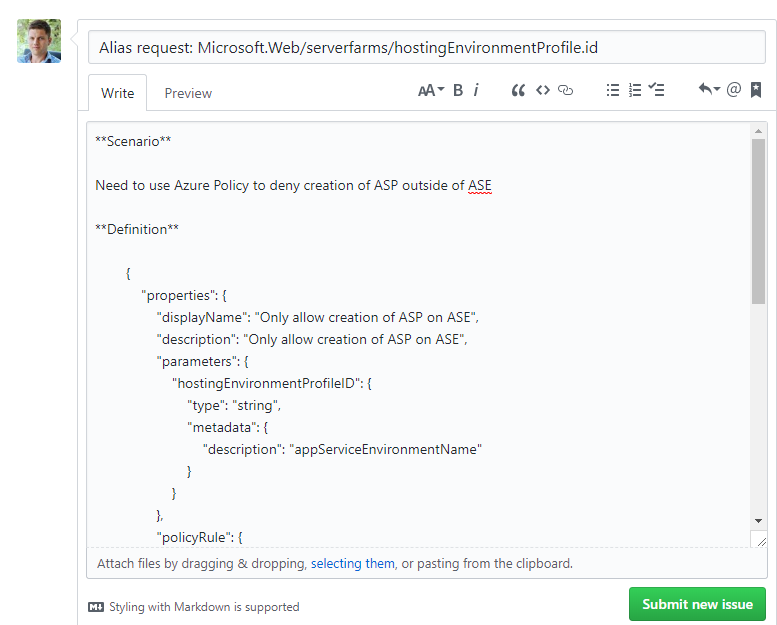

# Requesting aliases for Azure Policy

## What is a policy alias?

You use aliases to access specific properties for a resource type.

An alias enable you to restrict what values or conditions are permitted for a *property* on a resource. Each alias maps to the paths in different API versions for a given resource type. During policy evaluation, the policy engine gets the property path for that API version.
For more information about Policy and aliases, visit this [**blog post**](https://azure.microsoft.com/en-us/blog/more-resource-policy-aliases/)

## How to request a new policy alias?

1. File a new [*issue*](https://github.com/Azure/azure-policy/issues) to the Azure Policy Github repository
2. The title must include the Resource Provider namespace, resourceType(s) and property name, following this pattern: "Alias request: "RP/resourceType/propertyName"

Example: **Alias request: Microsoft.Web/serverfarms/hostingEnvironmentProfile.id**

3. Describe your policy scenario:

    - **Scenario** - What are you trying to achieve using Azure Policy for this scenario?
    - **Definition** - What is the proposed policy definition needed to achieve your scenario?

### Example:

**Scenario**

Need to use Azure Policy to deny creation of ASP outside of ASE
    
**Definition** 

        {
            "properties": {
                "displayName": "Only allow creation of ASP on ASE",
                "description": "Only allow creation of ASP on ASE",
                "parameters": {
                    "hostingEnvironmentProfileID": {
                        "type": "string",
                        "metadata": {
                            "description": "appServiceEnvironmentName"
                        }
                    }
                },
                "policyRule": {
                    "if": {
                        "allOf": [
                            {
                                "field": "type",
                                "equals": "Microsoft.Web/serverfarms"
                            },
                            {
                                "not": {
                                    "allOf": [
                                        {
                                            "field": "Microsoft.Web/serverfarms/hostingEnvironmentProfile.id",
                                            "equals": "[parameters('hostingEnvironmentProfileID')]"
                                        }
                                    ]
                                }
                            }
                        ]
                    },
                    "then": {
                        "effect": "deny"
                    }
                }
            }
        }

The request would look similar to the example below:

